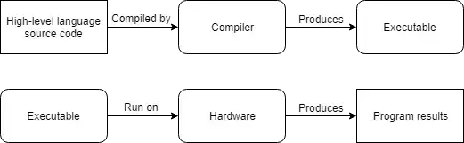
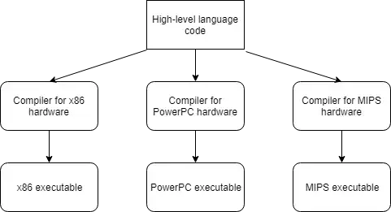

## 0.2 Introduction to programs and programming languages

Programs are executed on the computer's hardware, which consists of the physical components
- A CPU (central processing unit, often caled the "Brain" of the computer)
- Memory, where computer programs are loaded prior to execution
- Interactive devices (e.g. a monitor, touch screen...)
- Storage devices (e.g. a hard drive, SSD or flash memory)

In contrast, the term `software` broadly refers to the programs on a system that are designed to be executed on `hardware`.
The term `platform` refers to a compatible set of hardware and software (OS, browser, etc…) that provides an environment for software to run. Platform often provide useful services for the programs running on them. A program that can be easily transferred from one platform to another is said to be `portable`. The act of modifying a program so that it runs on a different platform is called `porting`.

### Maching Language
Machine language instructions (like 10110000 01100001) are ideal for a CPU
An assembly language (often called assembly for short) is a programming language that essentially functions as a more human-readable machine language.
Since CPUs do not understand assembly language, assembly programs must be translated into machine language before they can be executed. This translation is done by a program called an assembler. 

### Introduction to Low-level languages & high-level Languages
Low-level programs are hard to understand.The primary benefit of low-level languages is that they are fast. 
new “high-level” programming languages such as C, C++, Pascal (and later, languages such as Java, Javascript, and Perl) were developed.programs written in a high-level language must be translated into machine language before they can be run. There are two primary ways this is done: compiling and interpreting.
Most high-level languages can be either compiled or interpreted. High-level languages like C, C++, and Pascal are compiled, whereas “scripting” languages like Perl and Javascript tend to be interpreted.

**Compiling**
 

 

**Interpreting**
 

### The benefits of high-level languages
High-level languages allow programmers to write programs without knowing much about the platform it will be run on.
A program that is designed to run on multiple platforms is said to be cross-platform.

Programs written in a high-level language are easier to read, write, and learn because their instructions more closely resemble the natural language and mathematics that we use every day.

 
 

## Summary

1. Machine language is a language that the CPU understands, and it consists of only binary digits of 0 and 1.
2. Assembly is a level higher than machine language and is easier for humans to program in and understand. However, the CPU still only understands machine language, so the CPU manufacturer's architecture will have an assembler to convert the assembly to machine code.
3. C++ is a high-level language that can be interpreted or compiled. High-level languages are easier for humans to understand and code in, portable, and have more features. It still has to be translated to machine code to be run.
4. A compiled program goes through the following process: code is compiled by the compiler to create an executable. The executable is executed by the hardware to run the program instructions.
5. An interpreted language: code is interpreted by the interpreter and then run on hardware to execute program instructions.
6. Low-level languages are preferred for performance or resource restrictions, and high-level languages are easier to understand and more convenient.